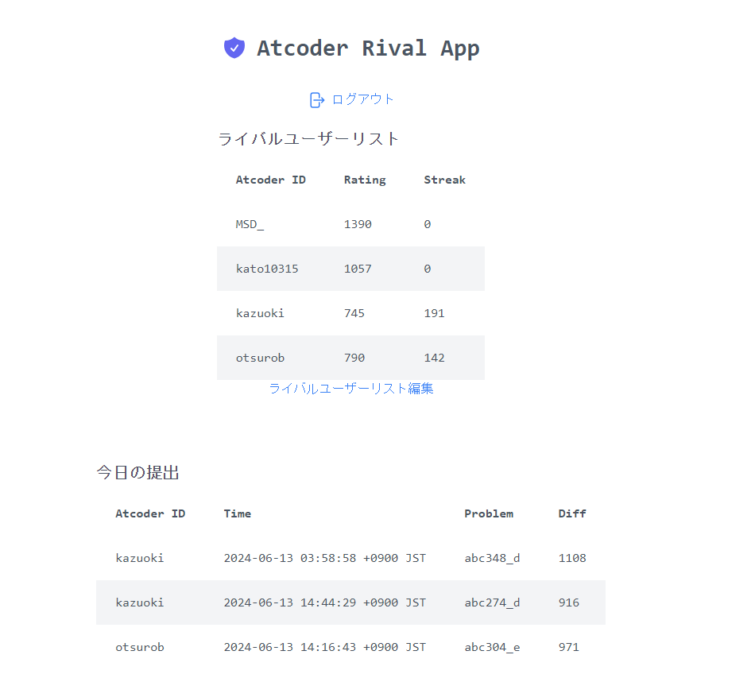
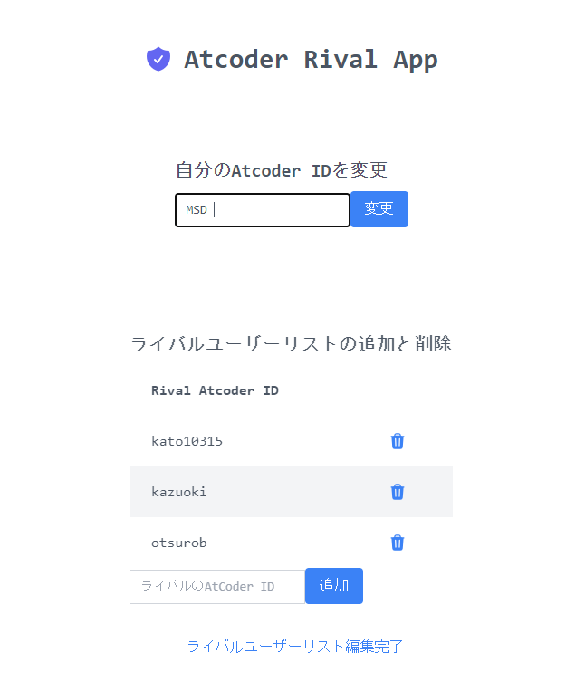

# Atcoder web app

## 動かし方
- `mv .env.sample .env`
- `docker-compose -f docker-compose.yml up --build`
- htpp://localhost:3000
## 使用例
- 以下の画面のように自分とライバルユーザーのレートとstreakが画面上部に表示され、画面下部には今日の提出リストが表示される
- 提出リストには問題とその難易度も表示される

- 以下の画面のようにライバルユーザーの編集が可能

## DB設計
### usersテーブル
- id : UUID primary key
- email 
- password
- atcoder_id

### raival_usersテーブル
- id : UUID primary key
- id_from
- id_to

## APIエンドポイント
### POST /signup
- ユーザー作成
- email, password, atcoder_id入力
### POST /login
- ログイン
### POST /logout
- ログアウト、ログイン画面にもどる
### POST /user/rival/{target_id}
- ライバルユーザー追加
- target_id(登録したいatcoder_idを入力)
### DELETE /user/rival/{target_id}
- 既存のライバルユーザー削除
### GET /user/rival
- ライバルユーザーリスト取得
### GET /user/table
- ライバルユーザーのrating, streakのリスト取得
### GET /user/submission/
### GET /user/profile
- 自分のatcoder_id取得
### POST /user/profile/{ID}
- 自分のatcoder_id変更

## メモ
- postmanでテスト<->chromeでテストの切り替えの際に以下が必要
  - user_controllerのcookie.secure変更
  - middlewareのsamemode
- docker-compose.ymlで動かす<->npm start, go run main.goで別々に動かす際にdb.goのhost変える必要がある